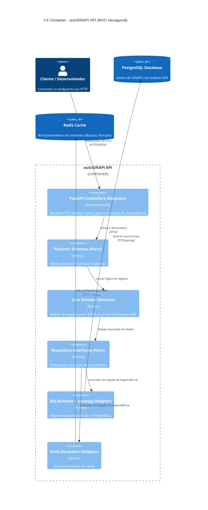

# 📐 Arquitetura da API — Híbrida MVC-Hexagonal

Este documento descreve a arquitetura da aplicação **autoSINAPI API**, estruturada sob um padrão híbrido que combina o fluxo MVC (Model-View-Controller) tradicional de rotas HTTP com a arquitetura de **Portas e Adaptadores (Hexagonal)** para a isolação do domínio de negócios.

---

## 1. Visão Arquitetural

A aplicação separa as preocupações em camadas concêntricas. O Core do Domínio está no centro, blindado de dependências tecnológicas externas (como o framework FastAPI ou drivers específicos de banco de dados).

---

## 2. Detalhamento das Camadas e Componentes

### 2.1. Camada Core Domain
Contém as entidades puras e a lógica analítica do SINAPI. Não faz importação de nenhum framework web.
*   **Serviços de Domínio:** Lógica recursiva da CTE de explosão da BOM, cálculo de produtividade (mão de obra vs. equipamento) e o ranqueamento financeiro para a Curva ABC.

### 2.2. Camada Application (Ports)
Define os contratos que permitem a comunicação com o mundo externo.
*   **Inbound Ports:** Schemas Pydantic (`schemas.py`) que validam os dados recebidos na requisição e determinam o formato de serialização do JSON de saída.
*   **Outbound Ports:** Contratos lógicos de persistência. A lógica do `crud.py` consome a interface de sessão do banco de dados (SQLAlchemy Session) fornecida na injeção de dependências.

### 2.3. Camada Infrastructure (Adapters)
Implementações concretas de I/O.
*   **Inbound Adapters (Controllers):** Os arquivos [api/main.py](file:///z:/repos/autosinapi_api/api/main.py) que contêm as rotas FastAPI. Recebem as requisições HTTP, executam a sanitização e invocam a camada de aplicação/serviço.
*   **Outbound Adapters:**
    *   **Postgres Adapter:** Gerenciado por [api/database.py](file:///z:/repos/autosinapi_api/api/database.py). Conecta a aplicação ao PostgreSQL.
    *   **Cache Adapter:** Gerenciado por [api/cache_utils.py](file:///z:/repos/autosinapi_api/api/cache_utils.py). Implementa o cliente Redis e o decorator `@cache_result` para encapsular a lógica de cache transparente.

---

## 3. Direção de Dependência (Regra de Ouro)

Nenhuma classe, função ou variável declarada nas camadas mais internas (Core Domain) pode fazer referência ou importar componentes das camadas mais externas (FastAPI, Redis ou SQLAlchemy). Isso assegura a manutenibilidade e permite que a API Mínima (código livre) possa ser facilmente reutilizada ou portada para outros frameworks ou bancos de dados sem quebrar a lógica de negócio.
